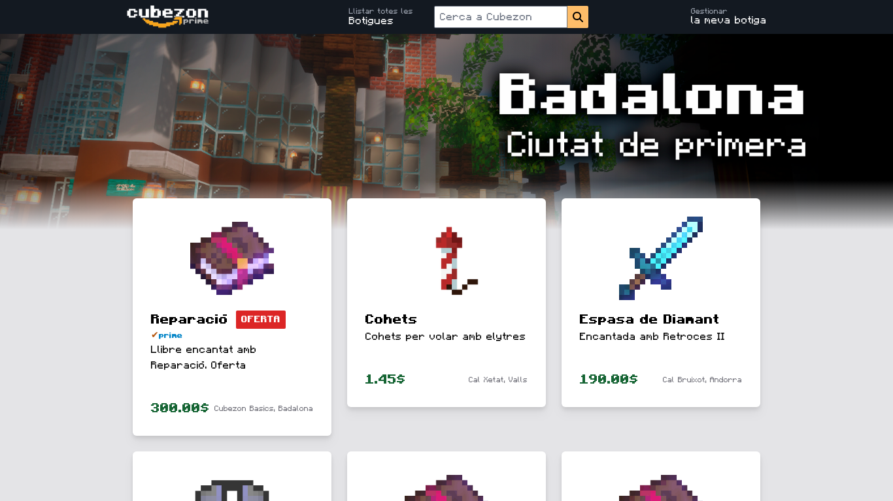

# Cubezon Marketplace

**Cubezon** és un marketplace en Minecraft inspirat en Amazon pel servidor de Minecraft [Cubecat](https://x.com/CubecatOficial), creat per facilitar la compra i venda de productes dins del joc. Aquest projecte està desenvolupat amb Laravel i està pensat per oferir una experiència intuïtiva i personalitzada als usuaris.

## Tecnologies emprades

- **Laravel 11.9:** El projecte està construït amb Laravel, un framework de PHP potent i molt flexible que facilita el desenvolupament de projectes web.
- **PHP 8.2:** Utilitzem la versió 8.2 de PHP per garantir un rendiment òptim, segur i de compatibilitat amb les últimes funcions de Laravel.
- **TailwindCSS:** Per a la maquetació i disseny de les interfícies, s'ha emprat TailwindCSS, una alternativa al CSS i al SCSS que m'ha permès crear fàcilment una aparença visual similar a la d'Amazon, però amb un toc de Minecraft.
- **Fonts personalitazdes:** He integrat la [Font de Minecraft](https://www.fontspace.com/minecraft-font-f28180) per donar-li un estil més autèntic i vinculat al joc. (Tenim un problema, la lletra **e** no pot portar accent).
- **Jetstream i Livewire:** Aquestes eines s'han utilitzat per implementar el sistema de login de manera eficient i fàcil, oferint una interfície elegant i funcional que només ha requerit la maquetació visual.

## Instal·lació

1. **Per clonar el repositori:**
```bash
git clone https://github.com/gfrancov/cubezon.git
cd cubezon
```

2. **Instal·lar dependències**
```bash
composer install
npm install
```

3. **Configuració de l'entorn**
- Còpia el fitxer `.env.example` i renombra'l a `.env`.
- Configura les variables d'entorn com la connexió a la base de dades, potser la configuració del correu (opcional), etc.

  
4. **Aixecar la base de dades amb migracions i seeding**
```bash
php artisan migrate --seed
```

5. **Compilar els actius**
- Pots fer servir `npm run dev` per compilar, o també `npm run watch` per anar maquetant amb TailwindCSS i visualitzar resultats alhora.

  
6. **Executar el servidor**

Tens dues opcions:
- Executes amb
```bash
php artisan serve
```
- Apuntes nginx o apache al directori cubezon/public

## Usabilitat i Interfície

El projecte està dissenyat per semblar-se al lloc web d'Amazon però amb l'estil característic de Minecraft, gràcies a TailwindCSS això ha sigut una tasca fàcil.

La combinació dels colors d'Amazon (`rgb(19,25,33)` i `rgb(248,165,27)` ) i la font de Minecraft crea una experiència visual que és tant funcional com fidel al tema del joc.



## Contribució

Les contribucions són benvingudes! Si vols contribuir, si us plau, fes un fork del projecte, crea una branca amb les teves modificacions i obre una sol·licitud de pull.
